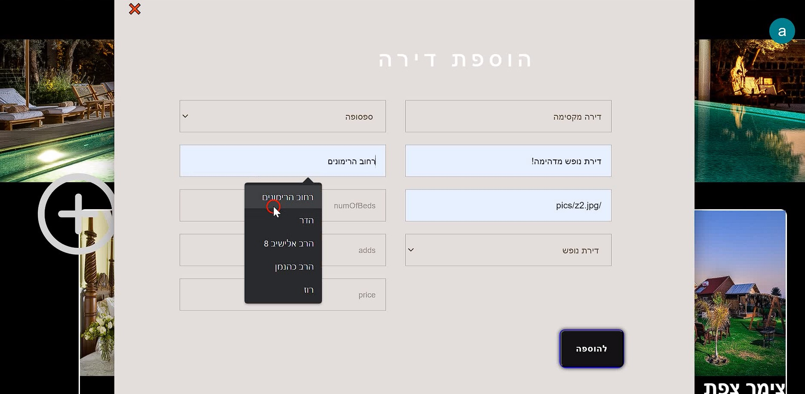

# Vacation Apartment Rentals

A full-stack web application for managing and renting vacation apartments across Israel.  
The platform allows users to browse available apartments with advanced filtering, and property owners to manage their listings easily.  

---

## 🚀 Features
- Browse and rent vacation apartments across Israel.
- Filters by:
  - Number of beds
  - Price
  - City
  - Apartment type
- Dynamic forms and generic components.
- Intuitive user interface.
- Built with a **3-layer architecture**: Controllers, Models, Routers.

---

## 🛠️ Tech Stack
- **Frontend:** React
- **Backend:** Node.js, Express.js
- **Database:** MongoDB
- **Other Libraries/Tools:**
  - dotenv
  - nodemailer
  - bcrypt
  - jsonwebtoken
  - mongoose

---

## 🔧 Installation & Setup

### Prerequisites
- Node.js (v14+)
- MongoDB

### Backend Setup
```bash
cd Node
npm install
npm start
```

### Frontend Setup
```bash
cd React
npm install
npm start
```

The backend will run on your configured server (default: http://localhost:5000)  
The frontend will run on http://localhost:3000.

---

---

## 📸 Screenshots

### 🏠 Login Or Register


### 🔍 Search Results


### 📝 Apartment Details


### 📝 New Apartment


---

---

## 📌 Project Status
✅ Completed and ready to use.
